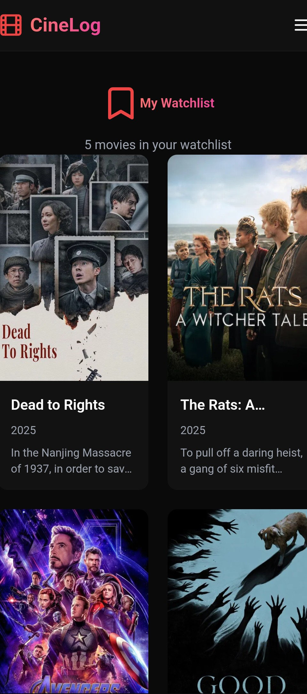

# 🎬 CineLog - Your Personal Movie Companion

<div align="center">


**Track, Discover, and Organize Your Movie Journey**

🌐 **[Live Demo](https://cine-log-ashen.vercel.app/)** | 📡 **[API](https://cinelog-production.up.railway.app)**

[Features](#-features) • [Tech Stack](#-tech-stack) • [Quick Start](#-quick-start) • [API Docs](#-api-documentation) • [Screenshots](#-screenshots)

</div>

---

## 🚀 Live Application

**🎯 Try it now:** [https://cine-log-ashen.vercel.app/](https://cine-log-ashen.vercel.app/)

- 🔍 **Smart Search** - Search millions of movies powered by TMDB API
- 📊 **Trending & Popular** - Discover what's hot right now
- 📝 **Personal Watchlist** - Save and manage movies you want to watch
- 🎭 **Deep Movie Details** - Explore comprehensive information for any movie
- 🔐 **Secure Authentication** - JWT-based user sessions
- 📱 **Responsive Design** - Beautiful UI that works seamlessly on all devices

---

## ✨ What Makes CineLog Special?

### 🎯 Core Features

**TMDB Integration**
- Real-time movie search using The Movie Database (TMDB) API
- Fetch trending movies updated daily
- Browse popular movies worldwide
- Access comprehensive movie details (cast, crew, ratings, runtime)
- Genre classification with 19+ categories
- High-quality movie posters and backdrops

**Watchlist Management**
- Create personal watchlists per user
- Add/remove movies with instant feedback
- Persistent storage in PostgreSQL database
- Track what you want to watch next
- User-specific watchlist isolation with JWT authentication

**User Authentication**
- Secure signup and login with BCrypt password hashing
- JWT token-based session management
- Protected API endpoints
- Stateless authentication architecture
- Spring Security integration

**Advanced Features**
- 🎬 Deep movie details with runtime, release dates, and ratings
- 🌍 Multi-language support (configurable via API)
- 🔄 Real-time data synchronization with TMDB
- ⚡ RESTful API architecture
- 🎨 Modern, responsive React frontend
- 🔒 CORS-enabled secure communication

---

## 🛠️ Tech Stack

### Backend (Spring Boot REST API)
```
Spring Boot 3.x      →  Enterprise Java framework
Spring Security      →  JWT authentication & authorization
Spring Data JPA      →  Database ORM layer
PostgreSQL           →  Production database (Supabase)
RestTemplate         →  HTTP client for TMDB API
BCrypt               →  Password encryption
Maven                →  Build & dependency management
Docker               →  Containerization support
```

### Frontend (React SPA)
```
React 18.2           →  Component-based UI library
React Router DOM     →  Client-side routing
Vite                 →  Fast build tool & dev server
Tailwind CSS         →  Utility-first styling
Axios                →  HTTP client for backend API
Context API          →  State management
Lucide React         →  Icon library
```

> **Note:** Frontend → Vibe-coded with Claude Sonnet 4.5.

### External APIs & Services
```
TMDB API            →  Movie data (search, trending, popular, details)
Railway             →  Backend hosting & deployment
Vercel              →  Frontend hosting & CDN
Supabase            →  Managed PostgreSQL database
```

---

## 🎬 How It Works

```
┌─────────────┐         ┌─────────────┐         ┌──────────────┐         ┌──────────────┐
│   Browser   │────────▶│   CineLog   │────────▶│  PostgreSQL  │         │   TMDB API   │
│  (React)    │◀────────│  REST API   │◀────────│   Database   │         │ themoviedb.org│
└─────────────┘         └─────────────┘         └──────────────┘         └──────────────┘
      │                        │                                                  │
      │   1. POST /signup      │                                                  │
      │───────────────────────▶│  Hash password with BCrypt                       │
      │                        │  Save user to PostgreSQL                         │
      │   2. Return success    │                                                  │
      │◀───────────────────────│                                                  │
      │                        │                                                  │
      │   3. POST /login       │                                                  │
      │───────────────────────▶│  Validate credentials                            │
      │                        │  Generate JWT token                              │
      │   4. Return JWT        │                                                  │
      │◀───────────────────────│                                                  │
      │                        │                                                  │
      │   5. GET /trending     │          6. GET trending/movie/day              │
      │───────────────────────▶│─────────────────────────────────────────────────▶│
      │                        │          7. Return movie list                    │
      │                        │◀─────────────────────────────────────────────────│
      │   8. Return movies     │  Add genre names from cache                      │
      │◀───────────────────────│                                                  │
      │                        │                                                  │
      │   9. POST /watchlist   │                                                  │
      │───────────────────────▶│  Verify JWT token                                │
      │  (with JWT header)     │  Extract user from token                         │
      │                        │  Save to watchlist table                         │
      │  10. Confirm added     │                                                  │
      │◀───────────────────────│                                                  │
```

---

## 📸 Screenshots

<div align="center">

### 🔐 Authentication

| Login Page | Signup Page |
|:---:|:---:|
|  |  |
| *Secure JWT-based login* | *Create your account* |

### 🏠 Discovery & Search

| Homepage |
|:---:|
|  |
| *Trending & popular movies* | 

| Search Results |
|:---:|
|  |
| *Find any movie from TMDB database* |

### 🎬 Movie Details

| Movie Overview | Deep Details |
|:---:|:---:|
|  |  |
| *Quick movie information* | *Comprehensive TMDB data* |

### 📋 Watchlist

| Add to Watchlist | Watchlist Page |
|:---:|:---:|
|  |  |
| *Instant feedback* | *Your personal collection* |

### ⚙️ Settings

| Options Menu |
|:---:|
|  |
| *User preferences* |

</div>

---

## 📡 API Documentation

### Base URL
```
Production:  https://cinelog-production.up.railway.app
Local:       http://localhost:8080
```

---

### 🔹 User Registration

**Endpoint:** `POST /api/auth/signup`

**Request:**
```json
{
  "name": "John Doe",
  "email": "john@example.com",
  "password": "SecurePass123!"
}
```

**Response:** `201 Created`
```json
{
  "message": "User created successfully"
}
```

**Error Cases:**
- `400 Bad Request` - User already exists or invalid format
- `400 Bad Request` - Invalid email or password format

---

### 🔹 User Login

**Endpoint:** `POST /api/auth/login`

**Request:**
```json
{
  "email": "john@example.com",
  "password": "SecurePass123!"
}
```

**Response:** `200 OK`
```json
{
  "token": "eyJhbGciOiJIUzI1NiIsInR5cCI6IkpXVCJ9...",
  "email": "john@example.com",
  "name": "John Doe"
}
```

**Error Cases:**
- `401 Unauthorized` - Invalid credentials
- `400 Bad Request` - Invalid request format

---

### 🔹 Search Movies (TMDB)

**Endpoint:** `GET /api/movies`

**Query Parameters:**
| Parameter | Type | Required | Description |
|-----------|------|----------|-------------|
| `query` | string | Yes | Search term |
| `language` | string | No | Language (default: en-US) |
| `page` | integer | No | Page number (default: 1) |
| `include_adult` | boolean | No | Include adult content (default: false) |
| `year` | integer | No | Filter by release year |
| `region` | string | No | ISO 3166-1 region code |

**Example:** `GET /api/movies?query=inception&language=en-US&page=1`

**Response:** `200 OK`
```json
{
  "page": 1,
  "results": [
    {
      "id": 27205,
      "title": "Inception",
      "overview": "Cobb, a skilled thief who commits corporate espionage...",
      "poster_path": "/9gk7adHYeDvHkCSEqAvQNLV5Uge.jpg",
      "backdrop_path": "/s3TBrRGB1iav7gFOCNx3H31MoES.jpg",
      "release_date": "2010-07-16",
      "vote_average": 8.367,
      "vote_count": 35428,
      "popularity": 89.405,
      "adult": false,
      "genre_ids": [28, 878, 53],
      "genres": ["Action", "Science Fiction", "Thriller"]
    }
  ],
  "total_results": 52,
  "total_pages": 3
}
```

---

### 🔹 Get Trending Movies (TMDB)

**Endpoint:** `GET /api/trending`

**Query Parameters:**
| Parameter | Type | Required | Description |
|-----------|------|----------|-------------|
| `language` | string | No | Language (default: en-US) |

**Example:** `GET /api/trending?language=en-US`

**Response:** `200 OK`
```json
{
  "page": 1,
  "results": [
    {
      "id": 558449,
      "title": "Gladiator II",
      "overview": "Years after witnessing the death of the revered hero Maximus...",
      "poster_path": "/2cxhvwyEwRlysAmRH4iodkvo0z5.jpg",
      "release_date": "2024-11-13",
      "vote_average": 7.2,
      "popularity": 2845.823,
      "genres": ["Action", "Adventure", "Drama"]
    }
  ],
  "total_results": 20
}
```

---

### 🔹 Get Popular Movies (TMDB)

**Endpoint:** `GET /api/popular`

**Query Parameters:**
| Parameter | Type | Required | Description |
|-----------|------|----------|-------------|
| `language` | string | No | Language (default: en-US) |
| `page` | integer | No | Page number (max: 500) |
| `region` | string | No | ISO 3166-1 region code |

**Example:** `GET /api/popular?language=en-US&page=1`

**Response:** `200 OK`
```json
{
  "page": 1,
  "results": [
    {
      "id": 533535,
      "title": "Deadpool & Wolverine",
      "overview": "A listless Wade Wilson toils away in civilian life...",
      "poster_path": "/8cdWjvZQUExUUTzyp4t6EDMubfO.jpg",
      "release_date": "2024-07-24",
      "vote_average": 7.7,
      "popularity": 4523.567,
      "genres": ["Action", "Comedy", "Science Fiction"]
    }
  ],
  "total_pages": 500,
  "total_results": 10000
}
```

---

### 🔹 Get Movie Details (TMDB)

**Endpoint:** `GET /api/movie/{movie_id}`

**Path Parameters:**
| Parameter | Type | Description |
|-----------|------|-------------|
| `movie_id` | integer | TMDB movie ID |

**Query Parameters:**
| Parameter | Type | Required | Description |
|-----------|------|----------|-------------|
| `language` | string | No | Language (default: en-US) |
| `append_to_response` | string | No | Additional data (e.g., credits,videos) |

**Example:** `GET /api/movie/27205?language=en-US`

**Response:** `200 OK`
```json
{
  "id": 27205,
  "title": "Inception",
  "tagline": "Your mind is the scene of the crime",
  "overview": "Cobb, a skilled thief who commits corporate espionage...",
  "runtime": 148,
  "release_date": "2010-07-16",
  "vote_average": 8.367,
  "vote_count": 35428,
  "budget": 160000000,
  "revenue": 825532764,
  "genres": [
    {"id": 28, "name": "Action"},
    {"id": 878, "name": "Science Fiction"},
    {"id": 53, "name": "Thriller"}
  ],
  "production_companies": [
    {"id": 923, "name": "Legendary Pictures"},
    {"id": 9996, "name": "Syncopy"}
  ],
  "poster_path": "/9gk7adHYeDvHkCSEqAvQNLV5Uge.jpg",
  "backdrop_path": "/s3TBrRGB1iav7gFOCNx3H31MoES.jpg"
}
```

---

### 🔹 Get User Watchlist

**Endpoint:** `GET /watchlist`

**Headers:** `Authorization: Bearer {jwt_token}`

**Response:** `200 OK`
```json
[
  {
    "id": 1,
    "tmdbId": 27205,
    "title": "Inception",
    "posterPath": "/9gk7adHYeDvHkCSEqAvQNLV5Uge.jpg",
    "overview": "Cobb, a skilled thief...",
    "releaseDate": "2010-07-16",
    "voteAverage": 8.367,
    "addedAt": "2025-11-01T13:36:54Z"
  }
]
```

**Error Cases:**
- `401 Unauthorized` - Invalid or missing JWT token
- `500 Internal Server Error` - Database error

---

### 🔹 Add to Watchlist

**Endpoint:** `POST /watchlist`

**Headers:** `Authorization: Bearer {jwt_token}`

**Request:**
```json
{
  "tmdbId": 27205,
  "title": "Inception",
  "posterPath": "/9gk7adHYeDvHkCSEqAvQNLV5Uge.jpg",
  "overview": "Cobb, a skilled thief...",
  "releaseDate": "2010-07-16",
  "voteAverage": 8.367
}
```

**Response:** `201 Created`
```json
{
  "id": 1,
  "tmdbId": 27205,
  "title": "Inception",
  "addedAt": "2025-11-01T13:36:54Z",
  "message": "Movie added to watchlist successfully"
}
```

**Error Cases:**
- `401 Unauthorized` - Invalid JWT token
- `409 Conflict` - Movie already in watchlist
- `400 Bad Request` - Invalid request data

---

### 🔹 Remove from Watchlist

**Endpoint:** `DELETE /watchlist/{tmdbId}`

**Headers:** `Authorization: Bearer {jwt_token}`

**Path Parameters:**
| Parameter | Type | Description |
|-----------|------|-------------|
| `tmdbId` | long | TMDB movie ID to remove |

**Response:** `200 OK`
```json
{
  "message": "Movie removed from watchlist successfully"
}
```

**Error Cases:**
- `401 Unauthorized` - Invalid JWT token
- `404 Not Found` - Movie not in watchlist
- `500 Internal Server Error` - Database error

---

## 🚀 Quick Start

### Prerequisites
- **Java 17+** (JDK 17 or higher)
- **Node.js 16+** (with npm)
- **Maven 3.6+** (or use included wrapper)
- **PostgreSQL** (or use Supabase)
- **TMDB API Key** (Get free key at [themoviedb.org](https://www.themoviedb.org/settings/api))

---

### Backend Setup

**1. Clone the repository**
```bash
git clone https://github.com/ISHANK1313/CineLog.git
cd CineLog
```

**2. Configure TMDB API Key**

Create `src/main/resources/secrets.properties`:
```properties
tmdb.api.key=YOUR_TMDB_API_KEY_HERE
```

Or set as environment variable:
```bash
export TMDB_API_KEY=your_api_key_here
```

**3. Configure Database**

Update `src/main/resources/application.properties`:
```properties
spring.datasource.url=jdbc:postgresql://localhost:5432/cinelog
spring.datasource.username=your_username
spring.datasource.password=your_password
spring.jpa.hibernate.ddl-auto=update
```

**4. Run Backend**
```bash
# Using Maven wrapper
./mvnw spring-boot:run

# Or build and run JAR
./mvnw clean package
java -jar target/CineLog-0.0.1-SNAPSHOT.jar

# Backend runs on http://localhost:8080
```

---

### Frontend Setup

**1. Navigate to frontend directory**
```bash
cd cinelog-frontend
```

**2. Install dependencies**
```bash
npm install
```

**3. Configure API URL**

Create `.env` file:
```env
VITE_API_URL=http://localhost:8080
```

**4. Run Frontend**
```bash
npm run dev

# Frontend runs on http://localhost:5173
```

---

### Docker Deployment

**1. Build Docker image**
```bash
docker build -t cinelog-backend .
```

**2. Run container**
```bash
docker run -p 8080:8080 \
  -e SPRING_DATASOURCE_URL=jdbc:postgresql://your-db-host:5432/cinelog \
  -e SPRING_DATASOURCE_USERNAME=your_username \
  -e SPRING_DATASOURCE_PASSWORD=your_password \
  -e TMDB_API_KEY=your_tmdb_key \
  cinelog-backend
```

---

## 📁 Project Structure

```
CineLog/
├── src/main/java/com/cinelog/CineLog/
│   ├── CineLogApplication.java           # Main Spring Boot application
│   ├── WebConfig.java                    # CORS configuration
│   ├── configuration/
│   │   └── AppConfig.java                # RestTemplate bean config
│   ├── controller/
│   │   ├── AuthController.java           # /api/auth/* endpoints
│   │   ├── CineController.java           # /api/* (TMDB endpoints)
│   │   └── WatchListController.java      # /watchlist/* endpoints
│   ├── service/
│   │   ├── UserService.java              # User management logic
│   │   ├── CineService.java              # TMDB API integration
│   │   └── WatchListService.java         # Watchlist operations
│   ├── repository/
│   │   ├── UserRepo.java                 # User JPA repository
│   │   └── WatchlistItemRepo.java        # Watchlist JPA repository
│   ├── entity/
│   │   ├── User.java                     # User entity
│   │   └── WatchlistItem.java            # Watchlist entity
│   ├── dto/
│   │   ├── SignUpDto.java                # Signup request DTO
│   │   ├── LoginRequestDto.java          # Login request DTO
│   │   ├── AuthResponse.java             # Auth response DTO
│   │   ├── SearchMovieDto.java           # Movie search parameters
│   │   ├── TodayTrendingDto.java         # Trending parameters
│   │   ├── PopularMovieDto.java          # Popular parameters
│   │   ├── MovieQueryDto.java            # Movie detail parameters
│   │   ├── MovieDto.java                 # Movie data
│   │   ├── MovieListResponse.java        # TMDB list response
│   │   ├── MovieDetailDto.java           # Detailed movie data
│   │   ├── GenreDto.java                 # Genre data
│   │   ├── GenreResponseDto.java         # Genre list response
│   │   └── AddToWatchList.java           # Watchlist add DTO
│   ├── security/
│   │   └── SecurityConfig.java           # Spring Security config
│   ├── util/
│   │   ├── JwtUtil.java                  # JWT token utilities
│   │   └── JwtRequestFilter.java         # JWT authentication filter
│   └── exception/
│       └── MovieServiceException.java    # Custom exception
├── src/main/resources/
│   ├── application.properties            # Main configuration
│   └── secrets.properties                # TMDB API key (gitignored)
├── cinelog-frontend/
│   ├── src/
│   │   ├── components/
│   │   │   ├── Navbar.jsx                # Navigation component
│   │   │   ├── MovieCard.jsx             # Movie display card
│   │   │   ├── SearchBar.jsx             # Search component
│   │   │   └── ProtectedRoute.jsx        # Route protection
│   │   ├── App.jsx                       # Main app component
│   │   └── main.jsx                      # Entry point
│   ├── pages/
│   │   ├── Login.jsx                     # Login page
│   │   ├── Signup.jsx                    # Signup page
│   │   ├── Home.jsx                      # Homepage
│   │   ├── Search.jsx                    # Search page
│   │   └── Watchlist.jsx                 # Watchlist page
│   ├── services/
│   │   ├── authService.js                # Auth API calls
│   │   ├── movieService.js               # Movie API calls
│   │   └── watchlistService.js           # Watchlist API calls
│   ├── context/
│   │   └── AuthContext.jsx               # Auth state management
│   ├── index.html                        # HTML entry point
│   ├── package.json                      # NPM dependencies
│   ├── vite.config.js                    # Vite configuration
│   ├── tailwind.config.js                # Tailwind CSS config
│   ├── postcss.config.js                 # PostCSS config
│   └── vercel.json                       # Vercel deployment config
├── screenshots/                          # Application screenshots
├── Dockerfile                            # Docker configuration
├── pom.xml                              # Maven dependencies
├── mvnw                                 # Maven wrapper (Unix)
├── mvnw.cmd                             # Maven wrapper (Windows)
└── README.md                            # This file
```

---

## 🔧 Configuration

### Backend Environment Variables

**Required:**
```properties
# TMDB API Configuration
tmdb.api.key=YOUR_TMDB_API_KEY

# Database Configuration
spring.datasource.url=jdbc:postgresql://your-host:5432/cinelog
spring.datasource.username=your_username
spring.datasource.password=your_password

# JPA Configuration
spring.jpa.hibernate.ddl-auto=update
spring.jpa.show-sql=false
spring.jpa.properties.hibernate.dialect=org.hibernate.dialect.PostgreSQLDialect

# JWT Configuration (auto-generated or custom)
jwt.secret=your_secret_key_here
```

**Optional:**
```properties
# Server Configuration
server.port=8080

# CORS Origins
cors.allowed.origins=https://cine-log-ashen.vercel.app,http://localhost:5173

# RestTemplate Timeouts
rest.template.connect.timeout=5000
rest.template.read.timeout=5000
```

---

### Frontend Environment Variables

Create `.env` in `cinelog-frontend/`:
```env
# Backend API URL
VITE_API_URL=https://cinelog-production.up.railway.app

# TMDB Image Base URL (for posters/backdrops)
VITE_TMDB_IMAGE_BASE=https://image.tmdb.org/t/p/w500
```

---

## 📊 Database Schema

```sql
-- Users table
CREATE TABLE users (
    id              BIGSERIAL PRIMARY KEY,
    name            VARCHAR(100) NOT NULL,
    email           VARCHAR(255) UNIQUE NOT NULL,
    password        VARCHAR(255) NOT NULL,  -- BCrypt hashed
    created_at      TIMESTAMP DEFAULT CURRENT_TIMESTAMP
);

-- Watchlist items table
CREATE TABLE watchlist_item (
    id              BIGSERIAL PRIMARY KEY,
    user_id         BIGINT NOT NULL,
    tmdb_id         BIGINT NOT NULL,
    title           VARCHAR(255) NOT NULL,
    poster_path     VARCHAR(500),
    overview        TEXT,
    release_date    VARCHAR(50),
    vote_average    DOUBLE PRECISION,
    added_at        TIMESTAMP DEFAULT CURRENT_TIMESTAMP,
    FOREIGN KEY (user_id) REFERENCES users(id) ON DELETE CASCADE,
    UNIQUE (user_id, tmdb_id)  -- Prevent duplicate entries
);

-- Indexes for performance
CREATE INDEX idx_watchlist_user_id ON watchlist_item(user_id);
CREATE INDEX idx_watchlist_tmdb_id ON watchlist_item(tmdb_id);
CREATE INDEX idx_users_email ON users(email);
```

---

## 🚀 Deployment Guide

### Backend on Railway

1. **Create New Project**
   - Go to [Railway.app](https://railway.app)
   - Click "New Project" → "Deploy from GitHub repo"
   - Select `ISHANK1313/CineLog`

2. **Add PostgreSQL Database**
   - Click "New" → "Database" → "Add PostgreSQL"
   - Railway auto-injects `DATABASE_URL`

3. **Set Environment Variables**
   ```
   TMDB_API_KEY=your_tmdb_api_key
   SPRING_PROFILES_ACTIVE=prod
   JWT_SECRET=your_generated_secret_key
   ```

4. **Configure Build**
   - Build Command: `mvn clean package -DskipTests`
   - Start Command: `java -jar target/CineLog-0.0.1-SNAPSHOT.jar`

5. **Deploy**
   - Railway auto-deploys on push to main branch
   - Get your URL: `https://your-app.up.railway.app`

---

### Frontend on Vercel

1. **Import Repository**
   - Go to [Vercel](https://vercel.com)
   - Click "Add New Project"
   - Import `ISHANK1313/CineLog`

2. **Configure Project**
   ```
   Framework Preset: Vite
   Root Directory: cinelog-frontend
   Build Command: npm run build
   Output Directory: dist
   Install Command: npm install
   ```

3. **Add Environment Variables**
   ```
   VITE_API_URL=https://cinelog-production.up.railway.app
   VITE_TMDB_IMAGE_BASE=https://image.tmdb.org/t/p/w500
   ```

4. **Deploy**
   - Vercel auto-deploys on push
   - Get your URL: `https://your-app.vercel.app`

---

### Database on Supabase

1. **Create Project**
   - Sign up at [Supabase](https://supabase.com)
   - Create new project
   - Choose region and database password

2. **Get Connection Details**
   - Go to Settings → Database
   - Copy connection string:
     ```
     postgresql://postgres:[PASSWORD]@[HOST]:5432/postgres
     ```

3. **Update Backend Config**
   - Add connection string to Railway environment variables
   - Or update `application.properties`

4. **Run Migrations**
   - Spring JPA will auto-create tables with `ddl-auto=update`
   - Or manually run SQL schema

---

## 🎯 Key Implementation Details

### TMDB API Integration

```java
@Service
public class CineService {
    @Value("${tmdb.api.key}")
    private String apiKey;
    
    @Autowired
    private RestTemplate restTemplate;
    
    // Genre cache loaded on application startup
    private HashMap<Integer, String> genreMap = new HashMap<>();
    
    @PostConstruct
    public void loadGenres() {
        // Fetch all genres from TMDB and cache them
        String url = "https://api.themoviedb.org/3/genre/movie/list?api_key=" + apiKey;
        GenreResponseDto response = restTemplate.getForObject(url, GenreResponseDto.class);
        // Store in HashMap for fast lookup
    }
    
    public MovieListResponse searchMovie(SearchMovieDto dto) {
        String url = UriComponentsBuilder
            .fromHttpUrl("https://api.themoviedb.org/3/search/movie")
            .queryParam("api_key", apiKey)
            .queryParam("query", dto.getQuery())
            .toUriString();
            
        MovieListResponse response = restTemplate.getForObject(url, MovieListResponse.class);
        addGenresToMovies(response.getResults()); // Add genre names
        return response;
    }
}
```

### JWT Authentication

```java
@Service
public class JwtUtil {
    @Value("${jwt.secret}")
    private String SECRET_KEY;
    
    private static final long EXPIRATION_TIME = 1000 * 60 * 60 * 24 * 7; // 7 days
    
    public String generateToken(String email) {
        return Jwts.builder()
            .setSubject(email)
            .setIssuedAt(new Date())
            .setExpiration(new Date(System.currentTimeMillis() + EXPIRATION_TIME))
            .signWith(SignatureAlgorithm.HS256, SECRET_KEY)
            .compact();
    }
    
    public String extractEmail(String token) {
        return Jwts.parser()
            .setSigningKey(SECRET_KEY)
            .parseClaimsJws(token)
            .getBody()
            .getSubject();
    }
}
```

### Spring Security Configuration

```java
@Configuration
@EnableWebSecurity
public class SecurityConfig {
    @Bean
    public SecurityFilterChain filterChain(HttpSecurity http) throws Exception {
        http.csrf(csrf -> csrf.disable())
            .sessionManagement(session -> 
                session.sessionCreationPolicy(SessionCreationPolicy.STATELESS))
            .authorizeHttpRequests(auth -> auth
                .requestMatchers("/api/auth/**").permitAll()  // Public endpoints
                .requestMatchers(HttpMethod.OPTIONS).permitAll()  // CORS preflight
                .anyRequest().authenticated())  // All others need JWT
            .addFilterBefore(jwtRequestFilter, UsernamePasswordAuthenticationFilter.class);
        return http.build();
    }
}
```

### Password Hashing

```java
@Service
public class UserService {
    @Autowired
    private PasswordEncoder passwordEncoder;  // BCrypt
    
    public boolean signUpUser(SignUpDto dto) {
        // Hash password before storing
        User user = new User();
        user.setEmail(dto.getEmail());
        user.setPassword(passwordEncoder.encode(dto.getPassword()));
        userRepo.save(user);
        return true;
    }
    
    public AuthResponse loginUser(LoginRequestDto dto) {
        User user = userRepo.findByEmail(dto.getEmail());
        
        // Verify hashed password
        if (passwordEncoder.matches(dto.getPassword(), user.getPassword())) {
            String token = jwtUtil.generateToken(user.getEmail());
            return new AuthResponse(token, user.getEmail(), user.getName());
        }
        return null;  // Invalid credentials
    }
}
```

---

## 🧪 Testing

### Test TMDB Integration

```bash
# Search movies
curl "https://cinelog-production.up.railway.app/api/movies?query=inception"

# Get trending movies
curl "https://cinelog-production.up.railway.app/api/trending?language=en-US"

# Get popular movies
curl "https://cinelog-production.up.railway.app/api/popular?page=1"

# Get movie details
curl "https://cinelog-production.up.railway.app/api/movie/27205?language=en-US"
```

### Test Authentication

```bash
# Register user
curl -X POST https://cinelog-production.up.railway.app/api/auth/signup \
  -H "Content-Type: application/json" \
  -d '{
    "name": "Test User",
    "email": "test@example.com",
    "password": "SecurePass123!"
  }'

# Login user
curl -X POST https://cinelog-production.up.railway.app/api/auth/login \
  -H "Content-Type: application/json" \
  -d '{
    "email": "test@example.com",
    "password": "SecurePass123!"
  }'
```

### Test Watchlist (Requires JWT)

```bash
# Get watchlist
curl https://cinelog-production.up.railway.app/watchlist \
  -H "Authorization: Bearer YOUR_JWT_TOKEN"

# Add to watchlist
curl -X POST https://cinelog-production.up.railway.app/watchlist \
  -H "Authorization: Bearer YOUR_JWT_TOKEN" \
  -H "Content-Type: application/json" \
  -d '{
    "tmdbId": 27205,
    "title": "Inception",
    "posterPath": "/9gk7adHYeDvHkCSEqAvQNLV5Uge.jpg",
    "overview": "Cobb, a skilled thief...",
    "releaseDate": "2010-07-16",
    "voteAverage": 8.367
  }'

# Remove from watchlist
curl -X DELETE https://cinelog-production.up.railway.app/watchlist/27205 \
  -H "Authorization: Bearer YOUR_JWT_TOKEN"
```

---

## 🔒 Security Considerations

### Current Implementation ✅
- BCrypt password hashing (strength: 10)
- JWT token authentication (7-day expiration)
- CORS configuration for allowed origins
- SQL injection prevention via JPA
- Stateless session management
- Input validation with Jakarta Validation
- HTTPS enforced on production
- Secure password requirements

### Production Enhancements 🔧
- [ ] **Rate Limiting** - Implement request throttling
- [ ] **Refresh Tokens** - Long-lived session support
- [ ] **Email Verification** - Confirm user registration
- [ ] **Password Reset** - Forgot password flow
- [ ] **2FA** - Two-factor authentication
- [ ] **API Key Rotation** - Regular TMDB key updates
- [ ] **Input Sanitization** - XSS prevention
- [ ] **HTTPS Only** - Strict transport security

---

## 📈 Performance Optimization

### Current Features
- **Genre Caching**: Genres loaded once at startup and cached in HashMap
- **Database Indexing**: Indexes on user_id, tmdb_id, and email
- **JPA Query Optimization**: Lazy loading and query hints
- **Connection Pooling**: HikariCP (default in Spring Boot)
- **RestTemplate Timeouts**: 5-second connect/read timeouts
- **React Code Splitting**: Dynamic imports for routes
- **Vite Build Optimization**: Tree-shaking and minification

### Future Improvements
- [ ] Redis caching for TMDB responses
- [ ] CDN for movie poster images
- [ ] Database query result caching
- [ ] Pagination for large watchlists
- [ ] Service worker for offline support
- [ ] Image lazy loading
- [ ] Response compression (Gzip)

---

## 🐛 Troubleshooting

### Backend Issues

**TMDB API Errors**
```bash
# Check API key is set
echo $TMDB_API_KEY

# Verify key works
curl "https://api.themoviedb.org/3/movie/550?api_key=YOUR_KEY"

# Check application logs
tail -f logs/spring.log
```

**Database Connection Fails**
```bash
# Test PostgreSQL connection
psql -h your-host -U your-user -d cinelog

# Check environment variables
echo $SPRING_DATASOURCE_URL

# Verify credentials in application.properties
```

**JWT Token Issues**
```bash
# Decode JWT token to check expiration
# Use jwt.io or:
echo "YOUR_TOKEN" | cut -d'.' -f2 | base64 -d
```

---

### Frontend Issues

**API Connection Errors**
```bash
# Check .env file exists
cat .env

# Verify API URL is correct
echo $VITE_API_URL

# Check CORS in browser console
# Should allow: https://cine-log-ashen.vercel.app
```

**Build Fails**
```bash
# Clear cache and reinstall
rm -rf node_modules package-lock.json
npm install

# Check Node version
node --version  # Should be 16+

# Try build again
npm run build
```

---

## 🎓 Learning Resources

- [Spring Boot Documentation](https://spring.io/projects/spring-boot)
- [Spring Security Reference](https://docs.spring.io/spring-security/reference/index.html)
- [TMDB API Documentation](https://developers.themoviedb.org/3/getting-started/introduction)
- [JWT.io](https://jwt.io/) - Understanding JWT tokens
- [React Documentation](https://react.dev/)
- [Tailwind CSS Docs](https://tailwindcss.com/docs)
- [PostgreSQL Tutorial](https://www.postgresql.org/docs/)

---

## 🤝 Contributing

Contributions are welcome! Here's how:

1. Fork the repository
2. Create feature branch (`git checkout -b feature/amazing-feature`)
3. Commit changes (`git commit -m 'Add amazing feature'`)
4. Push to branch (`git push origin feature/amazing-feature`)
5. Open Pull Request

---

## 📝 License

This project is open source and available under the [MIT License](LICENSE).

---

## 📞 Contact & Support

- 🐛 **Issues:** [GitHub Issues](https://github.com/ISHANK1313/CineLog/issues)
- 💬 **Discussions:** [GitHub Discussions](https://github.com/ISHANK1313/CineLog/discussions)
- 👤 **Developer:** [@ISHANK1313](https://github.com/ISHANK1313)

---

<div align="center">

### ⭐ Star this repo if you found it helpful!

**Built with Spring Boot • Powered by TMDB API • Frontend vibe-coded with Claude Sonnet 4.5**

🎬 [Try CineLog Now](https://cine-log-ashen.vercel.app/) 🎬

</div>
